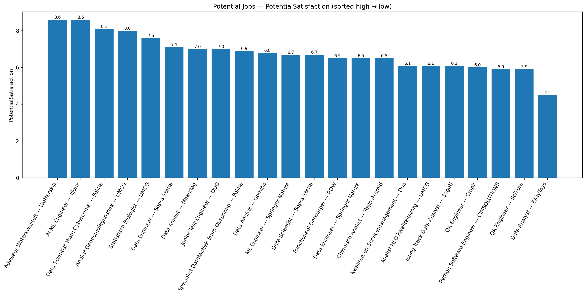

# BaanSoliciteren

Welkom bij mijn (semi-wetenschappelijke) zoektocht naar een baan.  
Het leek me een leuk, informatief 1/2-dagproject om alle gevonden vacatures te rangschikken. Gewoon simpele data-analyse, maar dan met een beetje smaak.

## Waarom?
Kort gezegd: **geld**, **geluk**, en alles wat je verder van een baan mag verwachten (uitdaging, team, impact, niet huilen op maandagochtend, gezelligheid van de solicitatie landpagina). Deze repo is mijn manier om dat te kwantificeren, hoewel ik waarschijnlijk beter mijn aandacht en tijd besteden aan het invullen van die solicitaties... Anyway, hiermee kon ik kort laten zien, onder enige tijdsdruk, dat ik een beetje data analyse kan.

## De 3 metrics
- **Fit** – Hoe goed past de rol bij mijn skills/profiel. Sommige dingen zijn best aan te leren (Cloud), maar als je de hele baan moet aanleren...
- **Salary** – Bruto indicatie. Gaat door een gladde, verzadigende curve (lagere salarissen tellen mee, hogere geven afnemende meerwaarde).
- **Preference** – Mijn eigen smaak (0–10, één decimaal). Subjectief en het allerbelangrijkste.

## Hoe wordt er gescoord? (kort)
- Per vacature lees ik `relevant_info.json` in uit `Solicitaties/<Job>_—_<Company>/`. (Vanuit **GDPR** helaas niet beschikbaar, persoonlijke emails/telefoonnummers van Contactpersonen staan hier ook bij)
- Salaris → **salary weight** via een afvlakkende functie (cap rond ~9.5 bij hogere salarissen, basiswaarde bij ~€2200).
- Alle drie componenten worden genormaliseerd (0–1) en licht “verscherpt”, zodat echte toppers boven komen drijven en de middelmaat… middelmaat blijft.
- Eindscore: een gewogen optelsom teruggeschaald naar **0–10**.  
  Daarnaast worden **PreferenceBased / FitBased / SalaryBased** gerapporteerd: welk deel van de score door welke component komt.

Resultaten landen in `Baan_analyze/Code-en-Data/CalculatedJobPotential.csv`, en met `plot_potential_jobs.py` rolt hier een staaf graffiekje uit, hoog naar laag.

## Privacy & housekeeping
Sommige data (contactpersonen, persoonlijke notities) gaat niet het internet op. `.gitignore` is daarop afgestemd om aan **GDPR** te voldoen. Als iets tóch per ongeluk voorbij komt, is dat een bug, geen feature.

## Kleine best practices
- JSON **schemas** voor consistente data in `stats.json` en `relevant_info.json`. **Future proof** gemaakt door ontwikkelingen te kunnen tracken (Response Status, Interview, etc)
- Data opgeslagen in eigen folders expliciet voor makkelijk veranderen, en het bijhouden van nieuwe banen en ontwikkelingen. Originele parsing in csv, nu in folders met .json voor leesbaarheid
- Losse, leesbare scripts i.p.v. een framework of classes.
- Reproduceerbaar genoeg voor later, simpel genoeg voor nu.

## TODO / Nog te doen
- **Echt solliciteren** en motivaties schrijven (oeps).
- Slim algoritme voor **deadlines** (incl. onbekende einddata) en **planning**: minimale sollicitaties per dag, maar wel op tijd — zodat ik efficiënt (lees: lui) kan zijn.

---
Persoonlijk project, serieuze intentie. Vragen of suggesties? Gooi ze in een [issue](../../issues/new), of stuur me een [email](mailto:tomthegreatest04@gmail.com)!  
Ook ben ik op veel platformen ([LinkedIn](https://www.linkedin.com/in/tomodovodoo), [Discord](https://discord.com/users/262208268682657792), etc) te bereiken via mijn gebruikersnaam **Tomodovodoo**.